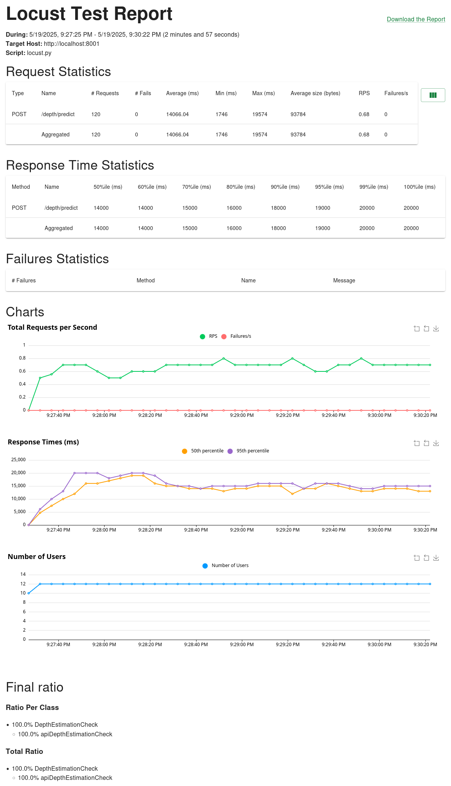

# Depth estimation model deployment with FastAPI and ONNX
Depth estimation model deployment with FastAPI and ONNX. In addition load testing is made with Locust.

The aim of this repository is to provide starter code for your ML models deployment or to serve as a demo base for your research project.

I am going to work with depth estimation and as a model [UniDepthV2](https://github.com/lpiccinelli-eth/unidepth) is selected.

## 🛠️ Setup

*This was made on Ubuntu 24.04 LTS with Python 3.12.3 and 16GB RAM*

### 🐍 Python Environment

```bash
python3 -m venv .env/
source .env/bin/activate
pip install -r requirements.txt
```

## 🌲 Repository Structure

```bash
├── app/                              # Main FastAPI application
│   ├── config.py                     # Application configuration settings
│   ├── __init__.py                   
│   ├── main.py                       # FastAPI application entry point
│   ├── predict.py                    # Prediction logic
│   ├── schemas.py                    # Schemas for API
│   └── structures.py                 # Data structures used by the app
├── assets/                           
│   └── room.jpg                      
├── checkpoints/                      # Model checkpoint directory
│   └── unidepthv2_vits_462_630.onnx  # ONNX model file for depth estimation
├── data/                             # Directory for input/output data
├── docker-compose.yml                
├── Dockerfile                        # Docker configuration for the API service
├── Dockerfile_unidepth               # Docker configuration for model conversion
├── LICENSE                           
├── logs/                             # Log directory
├── notebooks/                        # Experimentation
├── README.md                         # It's me =)
├── requirements_app.txt              # App-specific Python dependencies
├── requirements.txt                  # Python dependencies for running onnx-model
├── run_app.py                        # Script to run the application directly
├── run_service.sh                    # Shell script to start the service
├── scripts/                          # Utility scripts
│   ├── locust.py                     # Load testing script with Locust
│   └── run_unidepth_model.py         # Script to run the onnx-model directly
├── src/                              # Source code
│   ├── __init__.py                   
│   ├── model/                        # Model-related code
│   │   ├── __init__.py               
│   │   ├── model.py                  # ONNX model cover
│   │   └── unidepth_utils.py         # Utilities for the pre- and post- processing for UniDepth model
│   ├── UniDepth/...                  # Original UniDepth model repository (optional)
│   └── utils/                        # Utility functions
│       ├── image.py                  
│       ├── __init__.py               
│       ├── logging.py                
│       └── visualization.py          
└── tests/                            
    ├── __init__.py                   
    ├── test_api.py                   # API endpoint tests
    └── test_model.py                 # Model functionality tests
```
Generated with `tree .`.


## 🚀 Usage

You can use the model directly as shown in [the example script](scripts/run_unidepth_model.py).
```bash
python3 scripts/run_unidepth_model.py --model_path checkpoints/unidepthv2_vits_462_630.onnx --image_path data/coridor.jpg
```
Example, depth prediction for [the input image](assets/coridor.jpg) is .


Or you can run FastAPI service and then access it via API as shown in [the API test file](tests/test_model.py).
```bash
./run_service.sh
```

### Serve App with Docker

In the app config file set:
```Python
IS_IN_DOCKER = True
```

Launch with `docker-compose.yml`:
```bash
docker compose up --build
```

### Serve App with tmux
This method is not aimed for production use, but good for testing, especially on remote devices.

In the app config file set:
```Python
IS_IN_DOCKER = False
```

```bash
tmux new -s SESSION_NAME

# inside of it run service
./run_service.sh

# to exit session window use
ctrl+b + d

# to open session again
tmux a -t SESSION_NAME
```

More useful commands to learn [tmux](https://gist.github.com/MohamedAlaa/2961058).

### Run app tests

```bash
pytest tests/
```

### Load testing with Locust
```bash
# start service
./run_service.sh
# run locust test 
locust -f scripts/locust.py
```

As a result, you will get similar report 


## Add your own model

Here is how I added the model:

### Get target
Copy model's repository into `src/` folder.

```bash
cd src/
# clone your target repository
git clone https://github.com/lpiccinelli-eth/UniDepth.git

# then add it to .gitignore
cd ../
echo src/UniDepth >> .gitignore
```
**Note**: You can also add the repository using git submodule.

Second, follow model's specific instructions to launch it.


### Transform the model into ONNX format
In this case, I am going to use already provided code to export into `.onnx` format.

For completeness, here are the UniDepth specific instructions:
```bash
# to run Unidepth in the docker container do
cp Dockerfile_unidepth src/UniDepth/Dockerfile

# build container and export model to .onnx format
cd src/UniDepth

docker build -t dev_unidepth .
docker run -it --gpus all \
    --name cont_ud_1 \
    -v "$(pwd):/home/depth_estimation" \
    dev_unidepth

# inside of the container
python3 ./unidepth/models/unidepthv2/export.py --version v2 --backbone vits --shape 462 630 --output-path unidepthv2_vits_462_630.onnx
```

Finally, move the model to checkpoints folder:
```bash
mkdir checkpoints/
mv src/UniDepth/unidepthv2_vits_462_630.onnx checkpoints/
```


## License
This project is licensed under the MIT License - see the [LICENSE](LICENSE) file for details.

**NOTE**: [UniDepthV2](https://github.com/lpiccinelli-eth/unidepth) is released under [Creatives Common BY-NC 4.0 license](https://github.com/lpiccinelli-eth/UniDepth/blob/main/LICENSE).